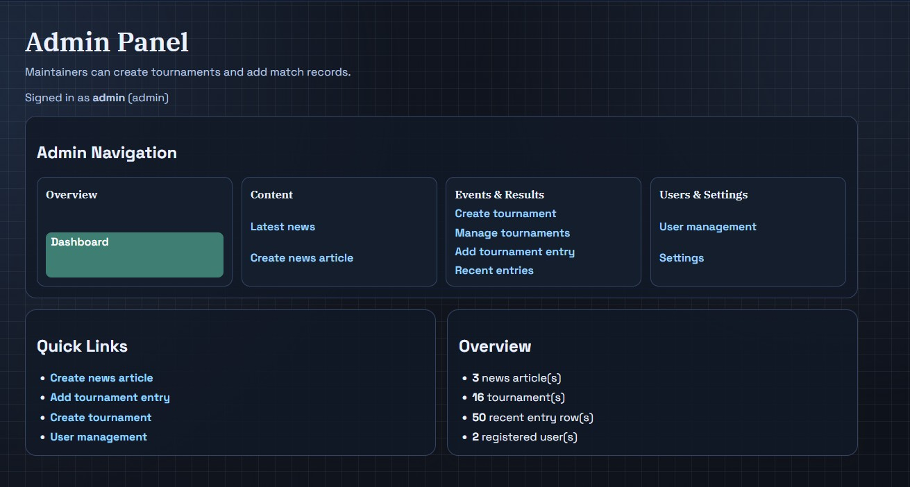
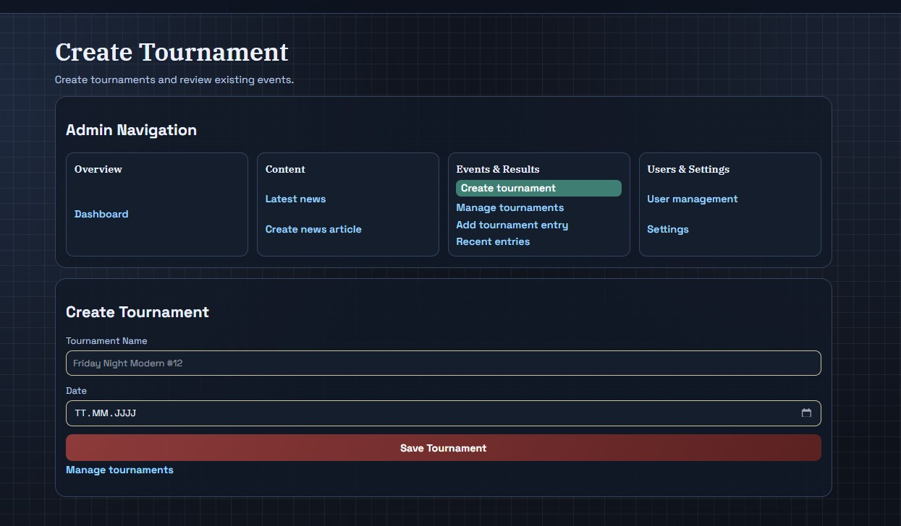
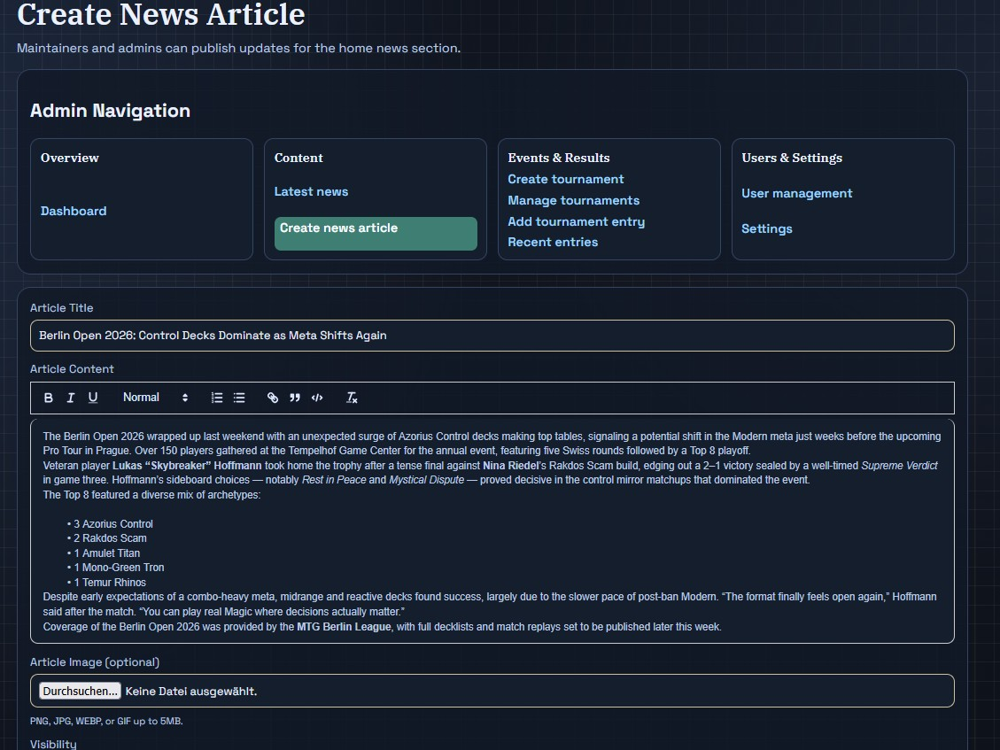
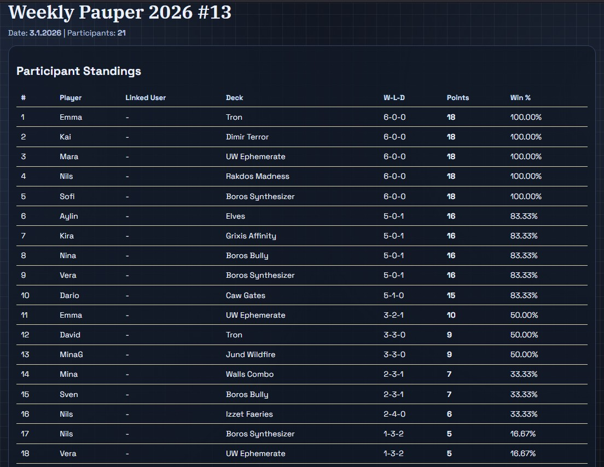
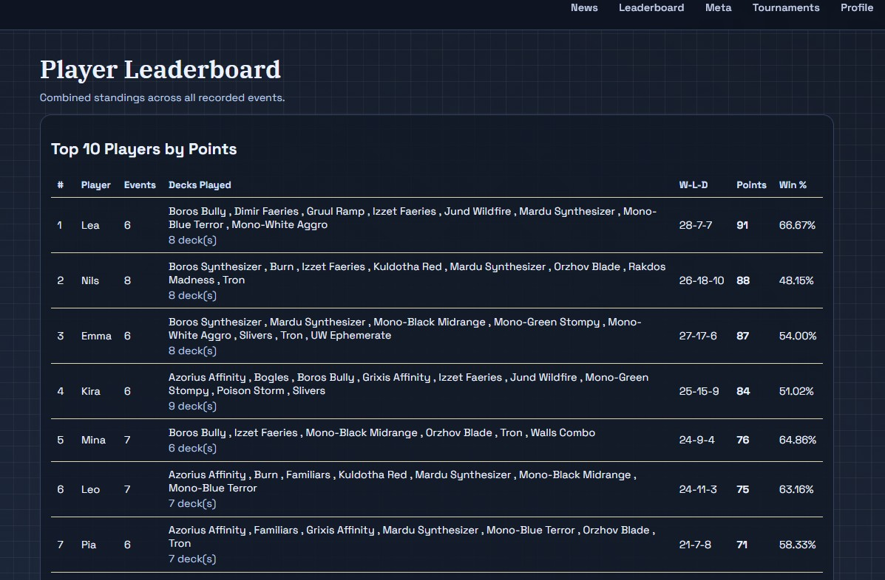
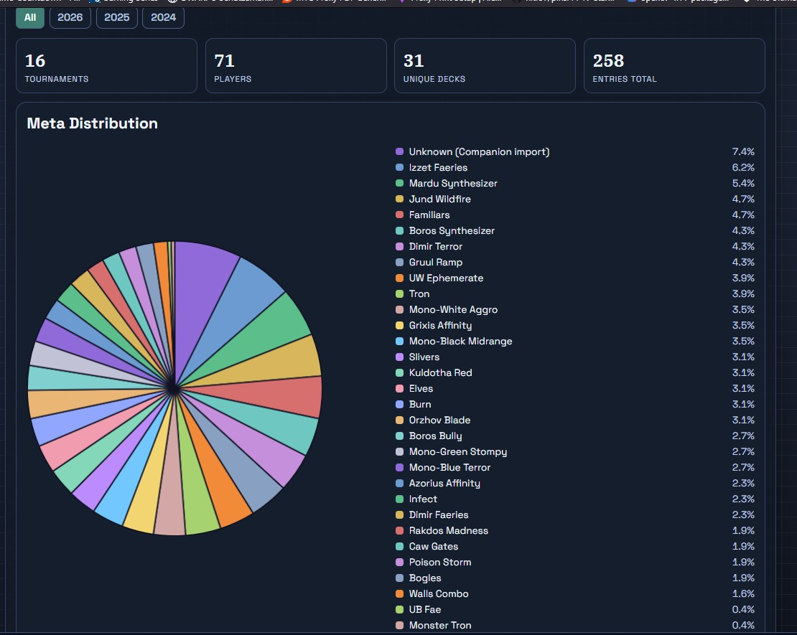
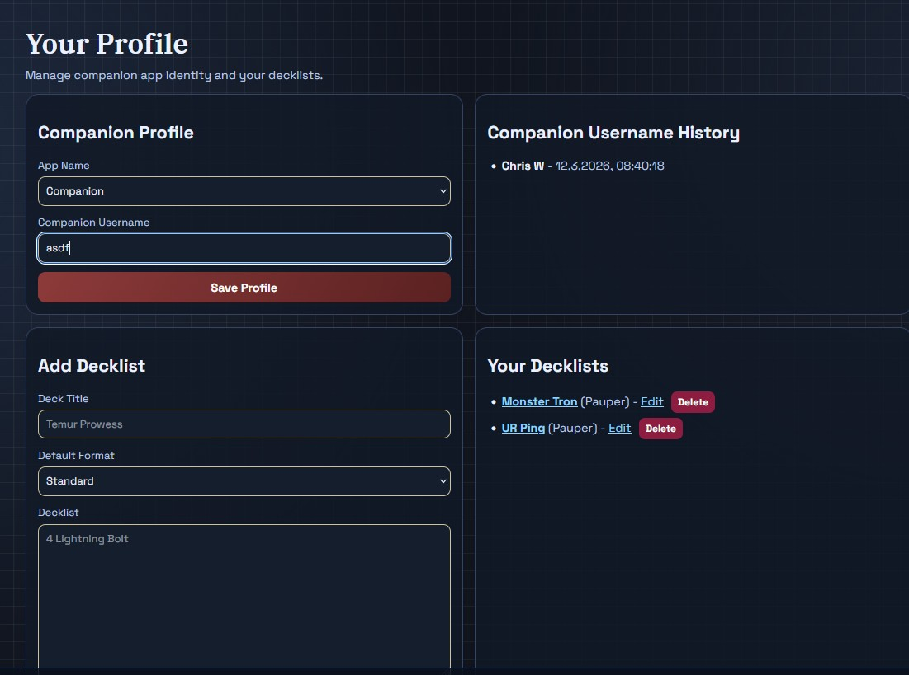
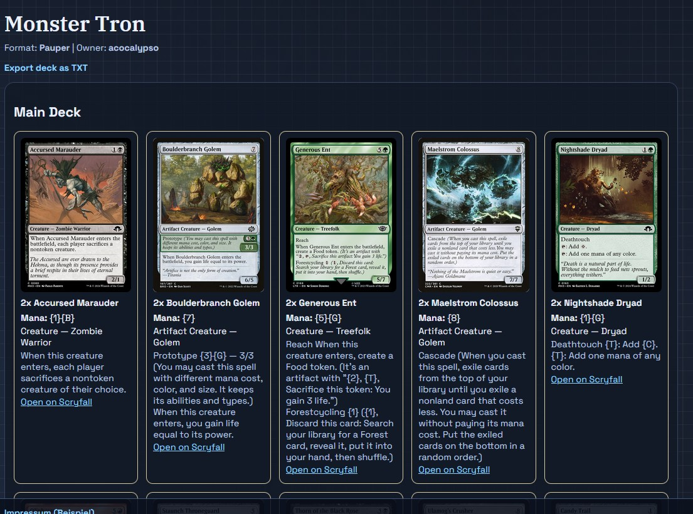

# MTG Tournaments - Feature Overview

This document describes all major features currently available in the web app.

## 1) Public Area

### News
- Homepage/news feed with published articles.
- Rich text content support.
- Optional article images.
- Footer-page articles available as static content pages (`/pages/:slug`).

### Leaderboard
- Top 10 players by points.
- Top 10 players by win-rate (minimum events threshold configurable by admin).
- Full player list with event/deck stats.
- W-L-D, points, and win percentage display.

### Meta Dashboard
- Year tabs (`All`, plus available years).
- KPI cards (tournaments, players, unique decks, entries).
- Deck distribution chart with legend and share percentages.
- Deck performance table and meta insights.

### Tournaments
- Tournament list with entry counts.
- Tournament detail page with participant standings.
- Deck breakdown per event.

### Deck Details
- Decklist pages with parsed cards.
- Scryfall enrichment.
- TXT export option.

## 2) Authentication and Roles

- Registration/login with hashed passwords.
- Optional email verification flow.
- Role system:
  - `user`
  - `maintainer`
  - `admin`

## 3) Profile and Decklists

- Companion app profile fields.
- Companion username history.
- Decklist CRUD (main + sideboard).
- Decklist edit and detail pages.

## 4) Admin Area

### Dashboard
- Quick links to key admin pages.
- Overview cards (news, tournaments, recent entries, users).

### News Management
- Create/edit news articles.
- WYSIWYG editor.
- Image upload.
- Visibility and publish date control.

### Tournament Management
- Separate pages for:
  - Create tournament
  - Manage tournaments
- Edit tournament name/date.
- Delete tournament with confirmation modal (OK/Cancel).

### Entry Management
- Manual entry creation with:
  - tournament
  - player
  - optional linked user/decklist
  - deck name
  - W-L-D
- Recent entries view.

### OCR Import (Companion Screenshots)
- Upload one or multiple screenshots.
- OCR detection with preprocessing and merge.
- Duplicate player cleanup.
- Review/edit step before save.
- Optional per-player deck name override.
- Default deck fallback for rows without deck value.
- Import progress modal while uploading/detecting.

### User/Admin Settings
- Role assignment.
- Legacy alias mapping.
- Companion app management.
- Registration confirmation policy.
- Site name setting.
- Leaderboard threshold setting.
- Consent management settings (see section 6).

## 5) UI/UX and Localization

- Dark/light theme toggle.
- Mobile-optimized admin/import layouts.
- Improved mobile navigation layout.
- EN/DE language support.
- Default locale configurable in setup.
- Locale persistence across logout (cookie + session fallback).

## 6) Consent Management

- Admin-configurable consent banner enable/disable.
- Versioned policy content.
- Editable EN/DE texts:
  - short banner text
  - detailed explanation
  - privacy links
- User options in banner:
  - essential only
  - accept all
  - custom selection (analytics/marketing)
- Consent saved with version and timestamp.
- Banner re-shown when policy version changes.

## 7) Security and Hardening

- CSRF protection.
- Rate limiting on auth endpoints.
- Session security configuration.
- Input sanitization for rich text and plain text fields.
- Parameterized SQL queries.

## 8) Screenshots

## Admin Dashboard

## Create Tournament

## Create News Article

## OCR Import Review

## Tournament Detail

## Leaderboard

## Meta Dashboard

## Profile

## Profile Decklists

